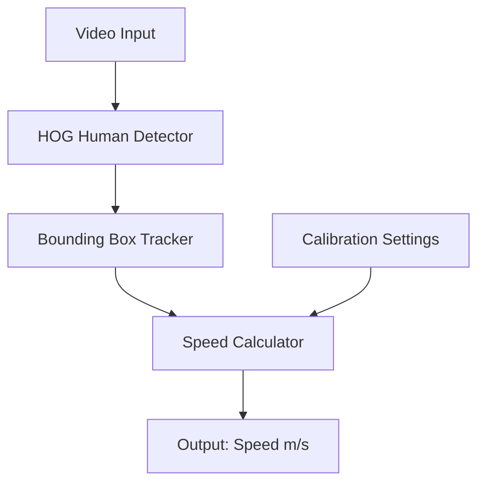

# 🏃 Speed of a Human Detector (C++17 + OpenCV)

A computer-vision project that detects a moving human in a video sequence and estimates their **speed in meters per second** using frame-to-frame tracking.

---

## 🚀 Features

- 👤 Human detection via OpenCV HOG model
- 🔁 Frame-to-frame motion tracking
- 📏 Pixel-to-meter speed conversion
- 🧮 Clear mathematical modeling of displacement

---

## 🧩 Architecture Overview



---

## 🛠️ Build Instructions

### Build

```bash
mkdir build && cd build
cmake ..
make
```

### Run

```bash
./human_speed_detector video.mp4
```

---

## 🔢 How Speed is Calculated

```
Speed = (Pixel Displacement / Calibration Factor) / Time Interval
```

---

## 💡 What I Learned

- Feature tracking & bounding box stabilization
- Real-time OpenCV pipelines
- Mapping image space to real-world metrics
- Performance optimization

---

## 🚧 Future Improvements

- Deep learning–based person detection (YOLOv8)
- Kalman filter for smoother tracking
- Multi-person tracking
